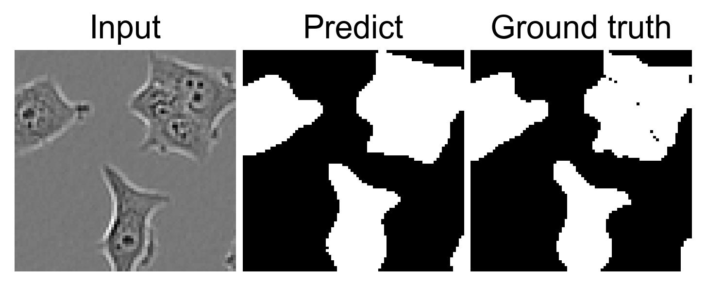

# UnsupDomaAda_for_SemaSeg_of_Cell_Images

This is the code for [Cell segmentation without annotation by unsupervised domain adaptation based on cooperative self-learning](hoge).
This project is carried out in cooperation with [Funahashi Lab. at Keio University](https://fun.bio.keio.ac.jp/).

## Overview

Our model performs unsupervised segmentation of 2D phase-contrast microscopic image.
Our model consists of two independent segmentation models and a mutual exchange mechanism of inference data.
The detailed information on this code is described in our paper published on [hoge](hoge).

## Performance

The result of unsupervised segmentation using our model is shown below.
The left image is the input phase-contrast microscopic image. 
The middle images is the predicted segmentation image.
The right image is the ground truth of segmentation.



Note: The input phase-contrast microscopic image and the output ground truth of the image
are part of a public cell image dataset published by Edlund et. al. [[1]](#ref1).

## Requirements

- OS: Ubuntu 18.04.6
- Language: python 3.8.5

- [Python 3.8.5](https://www.python.org/downloads/)
- [Pytorch 1.7.0](https://pytorch.org/)
- [Matplotlib 3.3.3](https://matplotlib.org/)
- [NumPy 1.19.2](http://www.numpy.org)
- [scikit-image 0.17.2](http://scikit-image.org/)

See ```requirements.txt``` for details. 

## QuickStart

1. Download this repository by `git clone`.
2. Download learned model.
3. Change directory to `QCANet/src`.
4. Run QCA Net.
    - On Linux:

        ```sh
        % git clone https://github.com/funalab/hoge.git
        % wget -P hoge/datasets https://fuga
        % wget -P hoge/models https://fuga
        % cd hoge
        % python src/test.py --inference-cell mcf7
        ```

    - On macOS:

        ```sh
        % git clone https://github.com/funalab/hoge.git
        % curl -o hoge/datasets https://fuga
        % curl -o hoge/models/learned_model https://fuga
        % cd hoge
        % python src/test.py --inference-cell mcf7
        ```

    The processing time of above example will be about 30 sec on GPU (NVIDIA V100).
    In this script, representative input image is stored in `images/example_input/Phase_Input.tif`, 
    the expected output of this segmentation is stored in `images/example_output/Predict_Output.tif`, and 
    the ground truth of the segmentations is stored in `images/example_output/Mask_Output.tif`.

## How to train and run model with your data

1. At first, prepare the dataset following the directory structure as follows:

    ```
    your_dataset/
           +-- train_data/  (train and validations images)
           |           +-- shsy5y/  (cell type)
           |           |           +-- cat_train/  (train and validation images for target images)
           |           |           |            +-- train_set_0/ 
           |           |           |            |             +-- Phase_Input_0.tif  (phase-contrast microscoopic image)
           |           |           |            |             +-- Mask_Output_0.tif (ground truth of segmentation)
           |           |           |            +-- train_set_1/ 
           |           |           |            |             +-- Phase_Input_1.tif  (phase-contrast microscoopic image)
           |           |           |            |             +-- Mask_Output_1.tif (ground truth of segmentation)
           |           |           |            +-- val_set_0/ 
           |           |           |            |             +-- Phase_Input_0.tif  (phase-contrast microscoopic image)
           |           |           |            +-- val_set_1/ 
           |           |           |            |             +-- Phase_Input_0.tif  (phase-contrast microscoopic image)
           |           |           +-- train/  (train images for source images)
           |           |           |            +-- train_set_0/ 
           |           |           |            |             +-- Phase_Input_0.tif  (phase-contrast microscoopic image)
           |           |           |            |             +-- Mask_Output_0.tif (ground truth of segmentation)
           |           |           |            +-- train_set_1/ 
           |           |           |            |             +-- Phase_Input_1.tif  (phase-contrast microscoopic image)
           |           |           |            |             +-- Mask_Output_1.tif (ground truth of segmentation)
           |           |           +-- val/  (validation images for target images)
           |           |           |            +-- val_set_0/ 
           |           |           |            |             +-- Phase_Input_0.tif  (phase-contrast microscoopic image)
           |           |           |            |             +-- Mask_Output_0.tif (ground truth of segmentation)
           |           |           |            +-- val_set_1/ 
           |           |           |            |             +-- Phase_Input_1.tif  (phase-contrast microscoopic image)
           |           |           |            |             +-- Mask_Output_1.tif (ground truth of segmentation)
           |           +-- mcf7/  (cell type)
           |           |           +-- cat_train/  (train and validation images for target images)
           |           |           |            +-- train_set_0/ 
           |           |           |            |             +-- Phase_Input_0.tif  (phase-contrast microscoopic image)
           |           |           |            |             +-- Mask_Output_0.tif (ground truth of segmentation)
           |           |           |            +-- train_set_1/ 
           |           |           |            |             +-- Phase_Input_1.tif  (phase-contrast microscoopic image)
           |           |           |            |             +-- Mask_Output_1.tif (ground truth of segmentation)
           |           |           |            +-- val_set_0/ 
           |           |           |            |             +-- Phase_Input_0.tif  (phase-contrast microscoopic image)
           |           |           |            +-- val_set_1/ 
           |           |           |            |             +-- Phase_Input_0.tif  (phase-contrast microscoopic image)
           |           |           +-- train/  (train images for source images)
           |           |           |            +-- train_set_0/ 
           |           |           |            |             +-- Phase_Input_0.tif  (phase-contrast microscoopic image)
           |           |           |            |             +-- Mask_Output_0.tif (ground truth of segmentation)
           |           |           |            +-- train_set_1/ 
           |           |           |            |             +-- Phase_Input_1.tif  (phase-contrast microscoopic image)
           |           |           |            |             +-- Mask_Output_1.tif (ground truth of segmentation)
           |           |           +-- val/  (validation images for target images)
           |           |           |            +-- val_set_0/ 
           |           |           |            |             +-- Phase_Input_0.tif  (phase-contrast microscoopic image)
           |           |           |            |             +-- Mask_Output_0.tif (ground truth of segmentation)
           |           |           |            +-- val_set_1/ 
           |           |           |            |             +-- Phase_Input_1.tif  (phase-contrast microscoopic image)
           |           |           |            |             +-- Mask_Output_1.tif (ground truth of segmentation)
           +-- test_data/  (test images)
           |           +-- shsy5y/  (cell type)
           |           |           +-- test_set_0/ 
           |           |           |            +-- Phase_Input_0.tif  (phase-contrast microscoopic image)
           |           |           |            +-- Mask_Output_0.tif (ground truth of segmentation)
           |           |           +-- test_set_1/ 
           |           |           |            +-- Phase_Input_1.tif  (phase-contrast microscoopic image)
           |           |           |            +-- Mask_Output_1.tif (ground truth of segmentation)
           |           +-- mcf7/  (cell type)
           |           |           +-- test_set_0/ 
           |           |           |            +-- Phase_Input_0.tif  (phase-contrast microscoopic image)
           |           |           |            +-- Mask_Output_0.tif (ground truth of segmentation)
           |           |           +-- test_set_1/ 
           |           |           |            +-- Phase_Input_1.tif  (phase-contrast microscoopic image)
           |           |           |            +-- Mask_Output_1.tif (ground truth of segmentation)
    ```
    Note: Filenames of the input and output images must contain the characters `Phase` and `Mask`, respectively.


2. Train model with the above-prepared dataset.
    
    Specify the folder names that contained source and target images using `--source` and `--target`option, respectively.
    The accepted options will be displayed by `-h` option.

    ```sh
    % python src/train.py --source shsy5y --target mcf7 [optional arguments]
    ```

    Prepare the config file describing detailed parameters for training.

    ```
    dataset-dir                                 : Specify directory path for dataset contained train, validation and test.
    output-dir                                  : Specify output files directory where model and log file will be stored.
    source                                      : Specify directory name for source cell type.
    target                                      : Specify directory name for target cell type.
    first-kernels                               : Specify number of kernels in the first layer in U-Net architecture.
    pse-conf                                    : Specify confidence weights based on discrepancy.
    scaling-type                                : Specify the image normalization method {normal, standard, unet}.
    epochs                                      : Specify the number of sweeps over the dataset to train.
    batch-size                                  : Specify minibatch size.
    learning-rate                               : Specify learning rate.
    optimizer_method                            : Specify optimizer {Adam, SGD}.
    seed                                        : Specify random seed.
    gpu                                         : Specify GPU ID (negative value indicates CPU).
    checkpoint                                  : Specify the path to the checkpoint file if you want to resume the training.
    ```

3. Run model with the above-prepared dataset.

    Specify the folder name contained test images using `--inference-cell` option
    Also, specify a learned model that generated by the above learning process.
    The accepted options will be displayed by `-h` option.

    ```sh
    % python src/test.py --inference-cell mcf7 --checkpoint models/learned_model [optional arguments]
    ```


# Acknowledgement

The microscopic images included in this repository are part of a public cell image dataset published by Edlund et. al. [[1]](#ref1).
We are grateful toYuyaKobayashi for valuable discussions.
The development of this algorithm was funded by MEXT/JSPSKAKENHI Grant Number JP18H04742 "Resonance Bio" to [Akira Funahashi](https://github.com/funasoul).

# References

<a name="ref1"></a> [[1] Christoffer Edlund, et al. "LIVECell—A large-scale dataset for label-free live cell segmentation" Nature Methods 18, 1038–1045 (2021).](https://www.nature.com/articles/s41592-021-01249-6)
